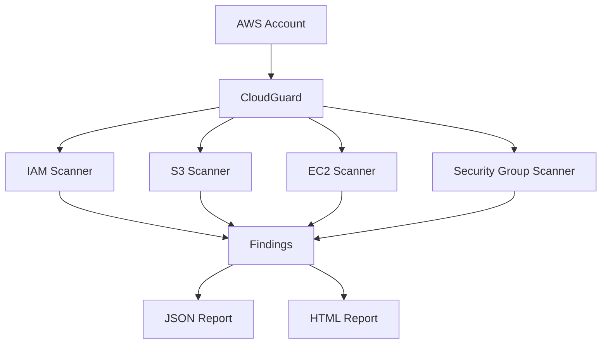
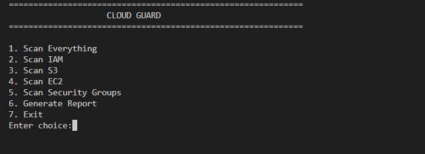
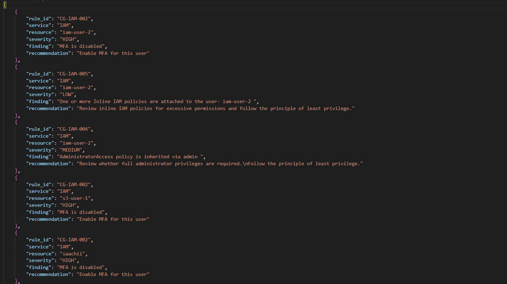
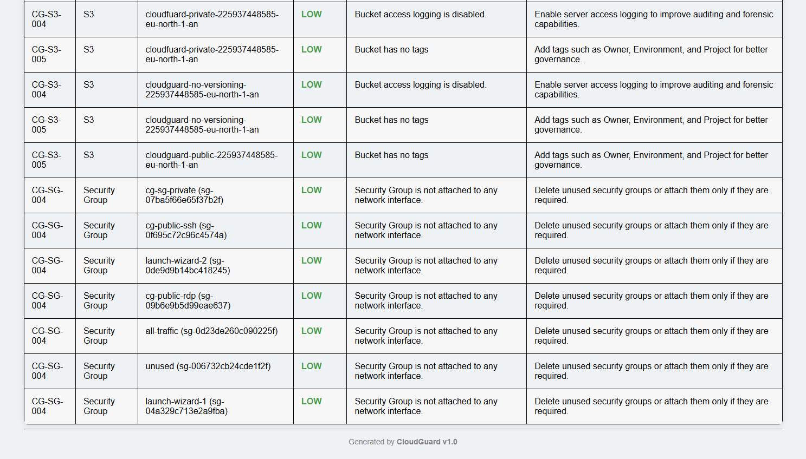
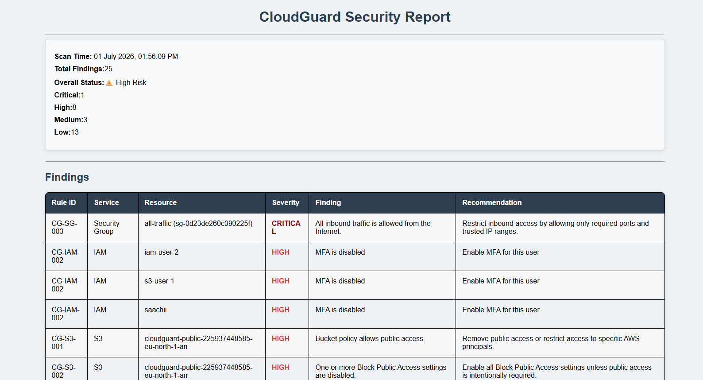

# CLOUDGUARD


CloudGuard is a Python-based AWS Cloud Security Posture Management (CSPM) tool that scans AWS resources for common security misconfigurations and generates detailed JSON and HTML security reports.
It helps identify security risks across multiple AWS services by using the AWS SDK for Python (Boto3).

## Table of Contents

- [Features](#features-of-cloudguard)
- [Installation](#installation)
- [WorkFlow](#workflow)
- [Usage](#usage)
- [IAM Scanner](#iam-scanner)
- [S3 Scanner](#s3-scanner)
- [EC2 Scanner](#ec2-scanner)
- [Security Group Scanner](#security-group-scanner)
- [Sample Report](#reporting)
- [Future Improvements](#future-improvements)
- [License](#license)

## Quick Overview

CloudGuard currently scans **4 AWS services** and performs **22+ security checks** to identify common cloud misconfigurations.

### Supported AWS Services

| Service | Checks |
|---------|--------:|
| IAM | 9 |
| Amazon S3 | 5 |
| EC2 | 4 |
| Security Groups | 4 |

### Report Formats

- HTML Report
- JSON Report

### Built With

- Python
- Boto3
- AWS SDK

## Workflow



## Prerequisites

Before running CloudGuard, ensure you have:

- Python 3.10 or later
- An AWS account
- AWS CLI installed
- AWS credentials configured
- Required Python packages installed

##  Installation

### 1. Clone the repository

```bash
git clone https://github.com/saachiaggarwal7/cloudguard.git
```

### 2. Navigate to the project

```bash
cd cloudguard
```

### 3. Install dependencies

```bash
pip install -r requirements.txt
```

### 4. Configure AWS credentials

```bash
aws configure
```

Enter:

- AWS Access Key ID
- AWS Secret Access Key
- Region (e.g. eu-north-1)
- Output format (json)

### 5. Run CloudGuard

```bash
python main.py
```

## ▶ Usage

Running CloudGuard displays the following menu:

```text
==================== CLOUDGUARD ====================

1. Scan Everything
2. Scan IAM
3. Scan S3
4. Scan EC2
5. Scan Security Groups
6. Generate Report
7. Exit
```

## Features of CloudGuard
### IAM Scanner
- Root account MFA
- User MFA
- AdministratorAccess policies
- Inline IAM policies
- Unused access keys
- Old access keys


| Rule ID    | Check                                         | Severity |
| ---------- | --------------------------------------------- | -------- |
| CG-IAM-001 | Root account MFA disabled                     | Critical |
| CG-IAM-002 | IAM user MFA disabled                         | High     |
| CG-IAM-003 | AdministratorAccess directly attached to user | Medium   |
| CG-IAM-004 | AdministratorAccess inherited via IAM Group   | Medium   |
| CG-IAM-005 | Inline policy attached to IAM user            | Low      |
| CG-IAM-006 | Inline policy inherited via IAM Group         | Low      |
| CG-IAM-007 | Access key unused for more than 90 days       | High     |
| CG-IAM-008 | Access key has never been used                | Low      |
| CG-IAM-009 | Access key older than 180 days                | High     |

### S3 Scanner
- Public bucket policies
- Block Public Access settings
- Bucket versioning
- Server access logging
- Bucket tagging

| Rule ID   | Check                                     | Severity |
| --------- | ----------------------------------------- | -------- |
| CG-S3-001 | Bucket policy allows public access        | High     |
| CG-S3-002 | Block Public Access settings are disabled | High     |
| CG-S3-003 | Bucket versioning is disabled             | Medium   |
| CG-S3-004 | Server Access Logging is disabled         | Low      |
| CG-S3-005 | Bucket has no tags                        | Low      |

### EC2 Scanner
- Public EC2 instances
- IMDSv2 enforcement
- CloudWatch detailed monitoring
- EBS volume encryption

| Rule ID    | Check                                   | Severity |
| ---------- | --------------------------------------- | -------- |
| CG-EC2-001 | Public IP assigned to EC2 instance      | High     |
| CG-EC2-002 | IMDSv2 not enforced                     | High     |
| CG-EC2-003 | CloudWatch detailed monitoring disabled | Low      |
| CG-EC2-004 | Unencrypted EBS volume                  | High     |

### Security Group Scanner
- Public SSH (Port 22)
- Public RDP (Port 3389)
- Unrestricted inbound traffic
- Unused Security Groups

| Rule ID   | Check                                     | Severity |
| --------- | ----------------------------------------- | -------- |
| CG-SG-001 | SSH (22) open to the Internet             | High     |
| CG-SG-002 | RDP (3389) open to the Internet           | High     |
| CG-SG-003 | All inbound traffic allowed (`0.0.0.0/0`) | Critical |
| CG-SG-004 | Unused Security Group                     | Low      |

## Reporting

- JSON Report
- HTML Report
- Severity Summary
- Recommendations

### Interactive CLI

CloudGuard provides a simple command-line interface that allows users to scan individual AWS services or perform a complete security assessment.



---

### JSON Report

CloudGuard generates a structured JSON report that can be integrated with automation pipelines or processed by other tools.



---

### HTML Report Summary

The HTML report provides an executive summary including the overall risk level, severity distribution, and total findings.



---

### HTML Findings

All findings are sorted by severity and include the affected AWS resource, rule ID, description, and remediation recommendation.



## Future Improvements

- Add RDS security scanner
- Add VPC security scanner
- Support multi-region scanning
- Export reports as PDF
- Integrate AWS Security Hub findings
- Build a web dashboard

## License

This project is licensed under the MIT License.